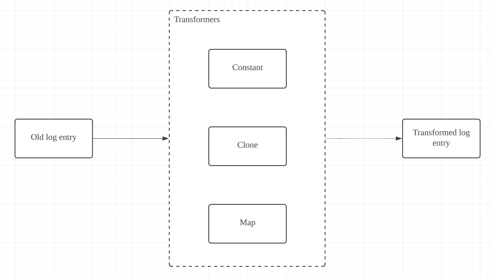

# Description

A logger module for [Nestjs](https://github.com/nestjs/nest), built on top of [node-bunyan](https://github.com/trentm/node-bunyan).

# Features

- A gloabl bunyan logger provider can be used in the controllers/services.
- Automatically log request/response with `request-id`, `timestamp`, `status-code`, etc.

# Usage

## Installation

### Yarn

```
yarn add @wiredcraft/nestjs-bunyan-logger
```

### NPM

```
npm install @wiredcraft/nestjs-bunyan-logger --save
```

## Integration

1. Import `LoggerModule` in the root App module, this provides initialized bunyan logger instance that is available to other modules by injection.

```typescript
import { Module } from '@nestjs/common';
import { LoggerConfig, LoggerModule } from '@wiredcraft/nestjs-bunyan-logger';
import configuration from './src/configuration';

@Module({
  imports: [
    ConfigModule.forRoot({
      load: [configuration],
    }),
    LoggerModule.forRootAsync({
      imports: [ConfigModule],
      useFactory: async (configService: ConfigService) => {
        return configService.get<LoggerConfig>('logger', { infer: true });
      },
      inject: [ConfigService],
    }),
  ],
})
export class AppModule {}
```

A sample configuration file is as below,

```typescript
export default () => ({
  logger: {
    name: 'awesome-app',
    level: 'info',
    streamType: 'FILE' | 'STDOUT',
    path: './logs/app.log', // only available for `FILE` streamType
    excludeReqPath: '/health', // the path that you want to skip logging
  },
});
```

2. Inject the logger instance to your service and use it as you want.

```typescript
import { Injectable } from '@nestjs/common';
import { Logger, Bunyan } from '@wiredcraf/nestjs-bunyan-logger';

@Injectable()
export class CatService {
  constructor(@Logger() private logger: Bunyan) {}
}
```

## Transformers Option



`transformers` is a config option that could allow the user to specify a list of customized transform rules to apply to each log entry. The current library supports three types of transformers: `constant`, `clone` and `map`.

### Constant

`constant` type allows the user to copy a **object type** constant directly to the log entry. An example is as follows:

```js
const options: LoggerConfig = {
  name: 'test-app',
  streamType: 'STDOUT',
  transformers: [{ constant: { customField: '123' } }],
};

logger.info({ originalField: 'abc' });

// The above will generate the following log entry:
//  {
//    originalField: 'abc',
//    customField: '123'
//  }
```

### Clone

`clone` type allows the user to copy value from one fieldname to the specified fieldname with the following rules:

- The original field is not removed from the log entry
- Only one embed level is allowed in new Fieldname specification

An example is as follows:

```js
const options: LoggerConfig = {
  name: 'test-app',
  streamType: 'STDOUT',
  transformers: [{ clone: { originalField: 'newField' } }],
};

logger.info({ originalField: 'abc' });

// The above will generate the following log entry:
//  {
//    originalField: 'abc',
//    newField: 'abc'
//  }
```

An one embed level example is as follows:

```js
const options: LoggerConfig = {
  name: 'test-app',
  streamType: 'STDOUT',
  transformers: [{ clone: { originalField: 'newParent.newField' } }],
};

logger.info({ originalField: 'abc' });

// The above will generate the following log entry:
//  {
//    originalField: 'abc',
//    newParent: {
//      {
//        newField: 'abc'
//      }
//    }
//  }
```

### Map

`map` type allows the user to apply a map value or a map function to the target field and replace the field value with the mapped value with the following rules:

- only one embed level is allowed for original field name specification

An example of simple map value is as follows:

```js
const options: LoggerConfig = {
  name: 'test-app',
  streamType: 'STDOUT',
  transformers: [{ map: { originalField: 'new-value' } }],
};

logger.info({ originalField: 'abc' });

// The above will generate the following log entry:
//  {
//    originalField: 'new-value',
//  }
```

An example of map function is as follows:

```js
const options: LoggerConfig = {
  name: 'test-app',
  streamType: 'STDOUT',
  transformers: [
    { map: { originalField: (oldValue) => oldValue + 'transformed' } },
  ],
};

logger.info({ originalField: 'abc' });

// The above will generate the following log entry:
//  {
//    originalField: 'abctransformed',
//  }
```

An one embed level example is as follows:

```js
const options: LoggerConfig = {
  name: 'test-app',
  streamType: 'STDOUT',
  transformers: [
    { map: { ['originalParentField.originalField']: 'new-value' } },
  ],
};

logger.info({
  originalParentField: {
    originalField: 'abc',
  },
});

// The above will generate the following log entry:
// {
//   originalParentField: {
//    originalField: 'new-value',
//   },
// }
```

### Multiple transformers

Multiple transformers are applied in the order as they are specified in the `transformers` option. An example is as follows:

```js
const transformers = [
  {
    constant: { customField: 'custom-value' },
  },
  {
    clone: { originalField: 'backupField' },
  },
  {
    map: { originalField: (oldValue) => oldValue + 'transformed' },
  },
];

const options: LoggerConfig = {
  name: 'test-app',
  streamType: 'STDOUT',
  transformers,
};

logger.info({ originalField: 'original-value' });

// The above will generate the following log entry:
// {
//   originalField: 'original-value-transformed',
//   backupField: 'original-value',
//   customField: 'custom-value'
// }
```

# Development

## Installation

```bash
$ npm install
```

## Publish

```bash
$ npm version major|minor|patch
$ npm publish
```

## License

[MIT licensed](LICENSE).
